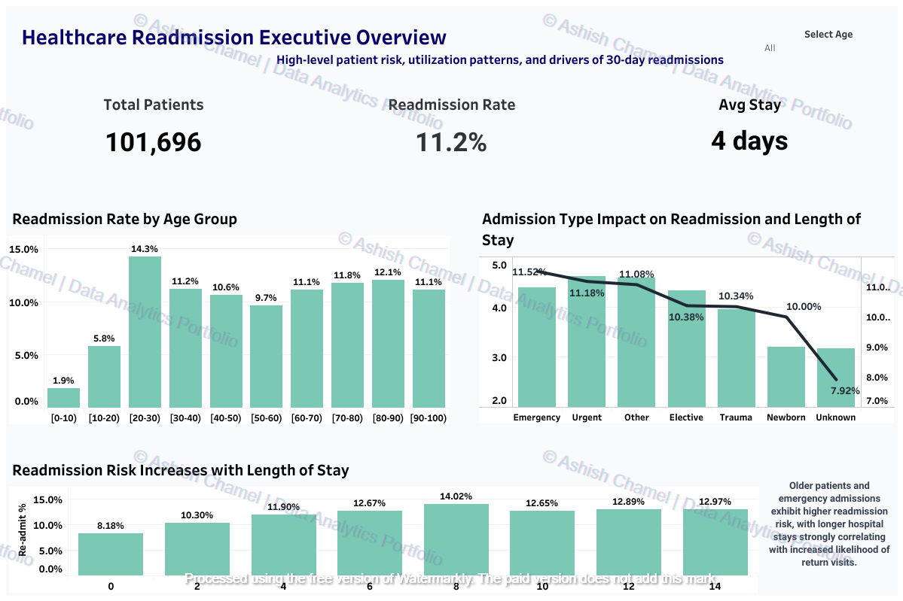
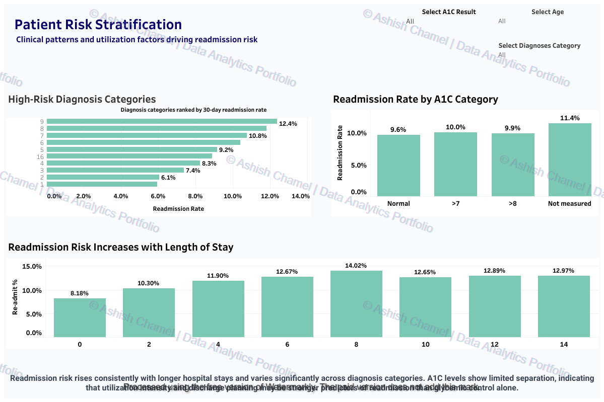
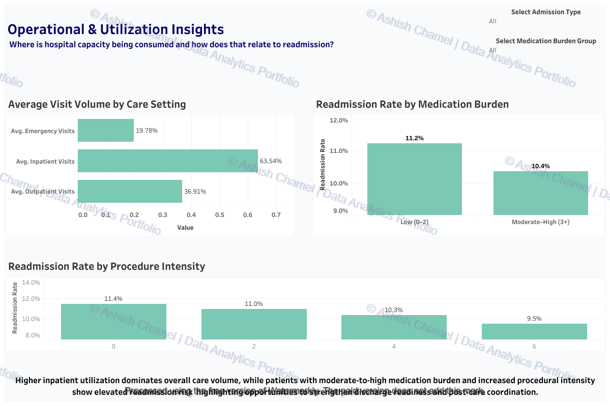

# Healthcare Readmission Analytics

Predicting 30-day hospital readmissions using SQL, Python, and Tableau.

This end-to-end analytics project examines clinical and operational drivers of patient readmissions using a structured workflow across Excel, MySQL, Python, and Tableau. The goal is to translate hospital encounter data into actionable insights for healthcare decision-makers.

---

## Overview

Goal: Identify key predictors of 30-day readmission and design executive dashboards for risk monitoring and operational improvement.

Key capabilities:

- Data cleaning and validation (Excel)  
- Aggregation and transformation (MySQL / SQL)  
- Exploratory analysis and feature engineering (Python)  
- Executive dashboards and storytelling (Tableau)  

---

## Project Workflow

### Step 1 — Excel (Initial Cleaning & Summary)

- Imported and validated raw dataset  
- Replaced placeholders (?, Unknown, None) with NULL  
- Dropped columns with >30% missing values (weight, payer_code, medical_specialty)  
- Created pivot tables for demographic summaries  

  

Key findings:

- Missing values concentrated in lab and non-critical fields  
- Dataset reduced from 50 to 47 columns with minimal information loss  

---

### Step 2 — SQL (Data Cleaning & ETL)

- Loaded cleaned CSV into MySQL  
- Created healthcare_readmission table  
- Applied NULLIF transformations  
- Indexed critical columns  
- Aggregated encounters by age, admission type, and diagnosis  

  

Key findings:

- Average readmission rate ≈ 11–12%  
- Emergency admissions and chronic diabetic patients show elevated risk  

---

### Step 3 — Python (EDA & Feature Engineering)

- Performed exploratory analysis using Pandas and Matplotlib  
- Encoded A1C and glucose results into categorical bins  
- Engineered features such as medication burden and distinct medication count  
- Exported Tableau-ready dataset  

  

Key findings:

- Length of stay strongly correlates with readmission  
- Medication burden and lab measurement gaps increase risk  

---

## Tableau — Executive Dashboards

Three dashboards translate analytics into operational intelligence.

---

### Healthcare Readmission — Executive Overview

  

High-level view of total patients, readmission rate, average stay, age-group risk, admission type impact, and length-of-stay trends.

---

### Patient Risk Stratification

  

Clinical segmentation by diagnosis category and A1C levels, highlighting that utilization intensity and discharge planning matter more than glycemic control alone.

---

### Operational & Utilization Insights

  

Operational dashboard showing inpatient dominance, medication burden impact, and procedure intensity — supporting targeted discharge and post-care strategies.

---

## Tools & Technologies

| Layer | Tools |
|------|------|
| Data Cleaning | Excel |
| Data Querying | MySQL |
| EDA & Feature Engineering | Python (Pandas, Matplotlib, NumPy) |
| Visualization | Tableau |
| Documentation | GitHub Markdown |

---

## Dataset Information

- Rows: 101,766  
- Columns: 47  
- Target variable: readmit_30d (Yes / No)  
- Processed export: data/processed/healthcare_processed.csv  

See:

data/raw/README_dataset_info.txt  
data/raw/DATA_ACCESS_NOTE.txt  

---

## Key Outcomes

- Analyzed 100k+ hospital encounters  
- Identified major drivers: age, admission type, length of stay, medication burden  
- Built executive dashboards for risk monitoring and operational optimization  
- Delivered reproducible workflow across SQL, Python, and Tableau  

---

## Author

Ashish Chamel  

Tableau Public  
https://public.tableau.com/app/profile/ashish.chamel  

LinkedIn  
https://www.linkedin.com/in/ashish-chamel  

---

Data earns trust through reproducibility — show the steps, show the results.
